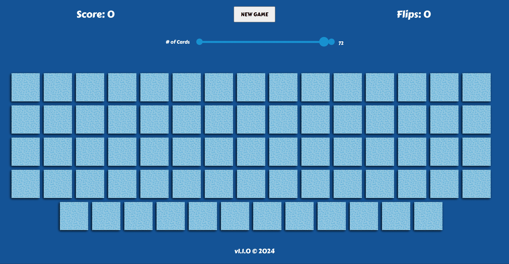
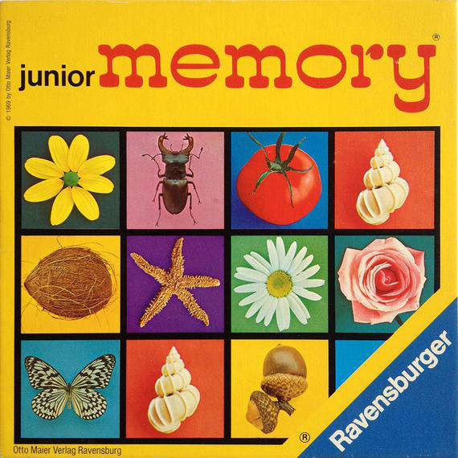

[](https://app.netlify.com/sites/junior-memory-1969/deploys)
# Remake Junior Memory 1969 from Ravensburger





Updated: 13-4-2024

## Highlights
* 72 cards (36 pairs)
* :root {--blue: #AEDCE9; } --> background-color: var(--blue);
* .firstElementChild(); (Similar to .firstChild());
* .lastElementChild();
* .gitignore
* gitignored files and folder become greyed out in explorer.
* Fisher-Yates shuffle algorithm.
* Flexbox: order. 
* CSS backface visibility. See resources section below.
* clearTimeout: Initiate a global variable. Within a function pass the timeout to this variable within local scope. Now this timeout is available globally. 
* Array.join(" * "); -> Where * is the seperator.


## Shuffles
<strong>Fisher-Yates shuffle algorithm</strong>

```javascript
    const cards = document.querySelectorAll(".card");
    for (let i = cards.length - 1; i > 0; i--) {
      let randIndex = Math.floor(Math.random() * (i + 1));
      cards[randIndex].style.order = i;
      cards[i].style.order = randIndex;
    }
```

<strong>Simple shuffle 1</strong>

```javascript
    for (let card of cards) {
    let num = Math.floor(Math.random() * cards.length);
    card.style.order = num;
    }
```

<strong>Simple shuffle 2</strong>

```javascript
cardArray.sort(() => 0.5 - Math.random());
```


## Resources
* https://github.com/WebDevSimplified/Mix-Or-Match
* https://github.com/kubowania/memory-game
* https://www.w3schools.com/CSSref/css3_pr_backface-visibility.asp 

